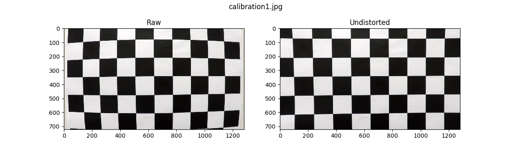
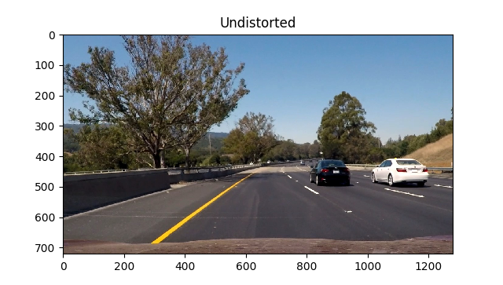
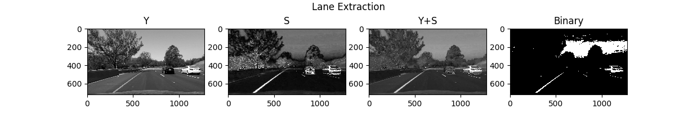
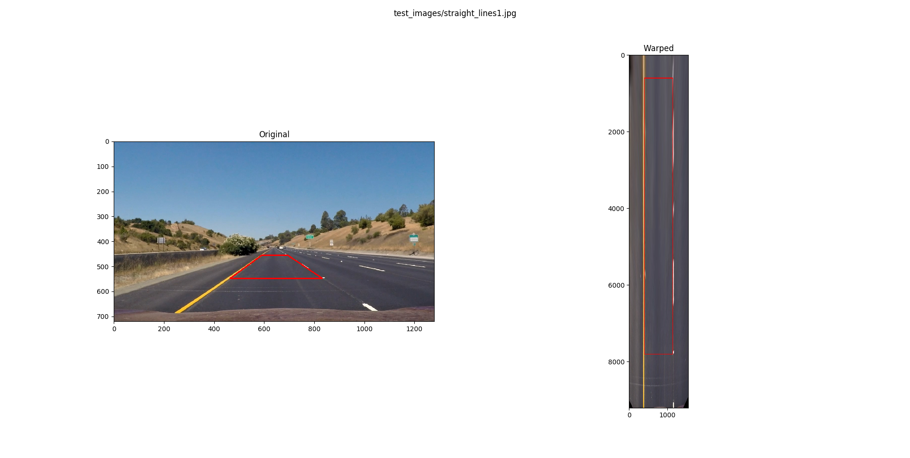
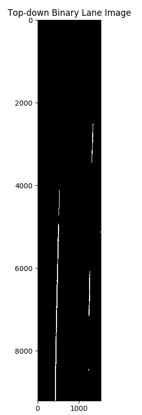
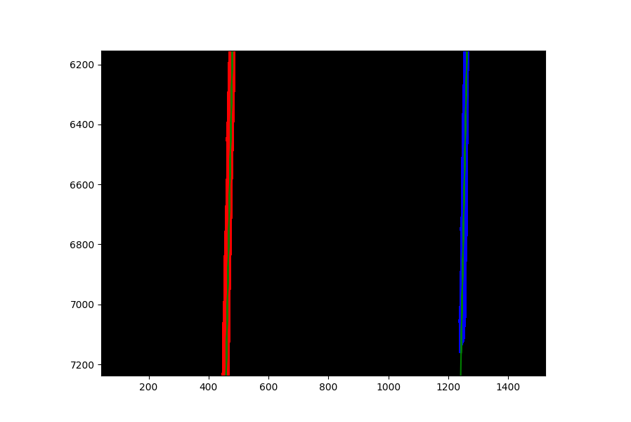
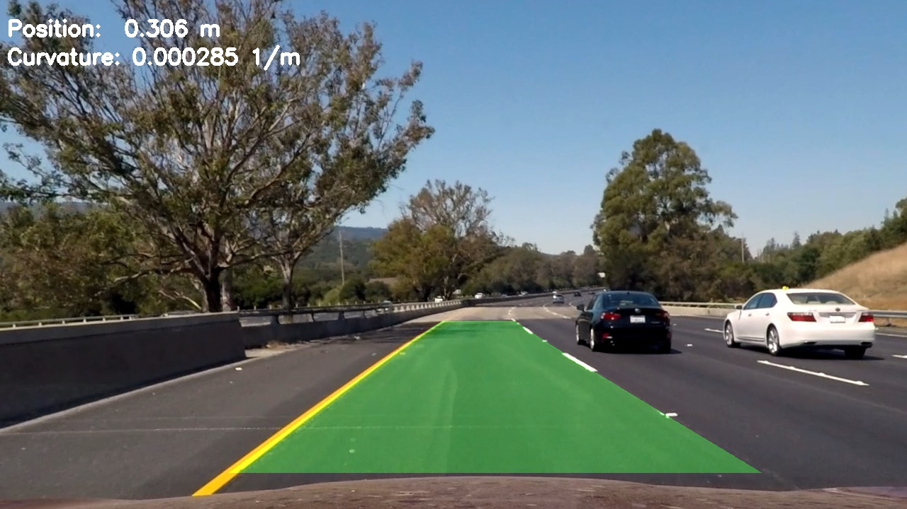

Self Driving Car Nanodegree Project 4: Advanced Lane Lines
===========================================================

In this project, I used more advanced image processing techniques to detect
the lane in front of a car from images taken by a forward-facing camera. The
general process for this project is as follows:

1. Calibrate the camera using a given set of chess board images.
2. Use the calculated camera calibration to perform distortion correction on
  the input image.
3. Use color transformations and gradients to create a thresholded binary
  image that emphasizes lane lines.
4. Apply a perspective transformation to rectify the binary image into a top-
  down view.
5. Detect which of the binary pixels are part of the left and right lane lines.
6. Fit a polynomial to the two lane lines.
7. Determine the curvature of the lane and the vehicle position with respect
  to the center of the lane.
8. Draw the detected lane and warp it back onto the original image perspective.
9. Output a visual display of the lane boundaries overlaid on the original
  image, as well as a numerical estimate of the lane curvature and vehicle
  position.

Camera Calibration and Distortion Correction
--------------------------------------------



The first step of the processing pipeline is undistortion, which is accomplished
using the `Undistorter` defined in `lanelines/processors.py`. The `Undistorter` uses
OpenCV's `undistort()` function to correct for lens distortion in the input
image.

The `undistort()` function requires a camera calibration matrix and a vector of
distortion coefficients. The code to generate the camera calibration can be
found in `bin/calibrate_camera`, which is a standalone script to generate these
parameters from a directory of chess board images. It opens all of the images
in the directory, finds the corners of the chessboards, and then uses OpenCV's
`calibrateCamera()` function to generate a camera calibration matrix and
distortion coefficients. The camera calibration matrix is saved to
`camera_matrix.npy` and the distortion coefficients are saved to
`distortion_coefficients.npy` to be loaded into the processing pipeline.

Here is the test image `test6.jpg` after distortion correction:



Binary Lane Image
-----------------



To extract the lane lines from the undistorted image, I tried several methods.
I discovered that the gradient does not work nearly as well for differentiating
the lanes from the other objects in the image. The lessons recommend thresholding
the gradient on the S channel, but I found that the S channel responded strongly
to cars as well as lane lines, and this would cause the lane line matching to
match on cars in the neighboring lane. Thresholding the gradients in different
ways did not seem to eliminate this problem.

Instead, I used the sum of the S channel of HLS and the Y channel of YUV. The
S channel responds to both white and yellow lane lines but also responds to
cars in the neighboring lanes. The Y channel responds more strongly to white
lines than yellow but responds to both. I normalize both and then sum them
to get a combined grayscale image that responds most strongly to the lines
(and responds to both yellow and white lines). I perform histogram equalization
on the grayscale image to account for differences in lighting then threshold
the image. Because this image responds so strongly to the lines, I was able to
use a relatively high threshold of 0.9. The most challenging image of the test
images was `test6.jpg`, which has a black car in the neighboring lane. You can
see that the S+Y channel responds more strongly to the lanes than the cars, and
the binary image contains only lane lines.

Top-down Perspective Transform
------------------------------



The third step of the pipeline is a perspective transformation from the camera's
point of view to a top-down perspective. This is accomplished with a
`GroundProjector` object. `GroundProjector` is a processor class that I defined
in `lanelines/processors.py` that encapsulates methods for transforming between the camera
perspective and the top-down perspective.

The `GroundProjector` needs a perspective transformation matrix, which I 
calculated in the script in `bin/perspective_calculation`. It has four points
that I manually picked in `straight_lines1.jpg` with known scale. I was
able to determine the scale by the length and separation of the dashed lane
lines on the right, which are a known distance apart. The script calculates the
output points necessary for a top-down image that shows the lane plus 2 meters
on either side, stretching from the hood of the car to 3 meters past the
furthest lane marker chosen, with a top-down image resolution of 200 pixels per
meter, for a resolution of 0.5 cm per pixel. `bin/perspective_calculation`
calculates the perspective transform matrix from the four point correspondences
using OpenCV's `getPerspectiveTransform()` method. Above, you can see the
rectangle defined by these four points before (left) and after (right)
transformation. `bin/perspective_calculation` constructs a `GroundProjector`
object and saves with a Python pickle to `projector.p`, which is loaded by the
pipeline and used for processing.

Here, you can see the same binary image from the previous step in the
pipeline transformed into the top-down perspective:



Lane-line Fitting
-----------------



Before it's possible to fit lane lines to the image, the binary image must
be converted to a set of pixel coordinates in the left and right lane lines.
This is performed using a sliding window search. The sliding window for each
line starts at the bottom of the image, at the peaks of a histogram of
x-coordinates of pixels in the bottom half of the image. There is a geometric
constraint that the peaks must be at least 2 meters apart, in case the two
strongest peaks are part of the same lane line. Once the starting x-coordinate
is known, a 2-meter wide rectangular window is moved up each of the lane lines.
In each iteration, the pixels inside the windows are added to the respective
pixel sets. If the centroid of the window is not in the center of the window,
the center of the next window is recentered on the x-coordinate of the centroid.
At the end of this process, there are two sets of pixel coordinates: one set
likely to belong to the left lane line and one set likely to belong to the
right lane line.

Once the pixels in the left and right lane have been selected, the `LaneFitter`
fits a quadratic polynomial to them. Rather than fit each line independently,
I fit two parallel quadratics to both sets at once using numpy's least squares
fit method. This takes advantage of the parallel-lines constraint inherent in
lane lines, which is especially helpful when one of the lines in sparse, as in
highway lane lines, which are dashed. The higher order terms of the polynomial
are fit to both lines simultaneously, and only the zeroth order terms are
dependent on the individual lane lines. The image above shows a section of the
binary image from the previous stage (zoomed in to make it possible to see the
pixels) with the left pixels in red, the right pixels in blue, and the joint
fit in green.


Vehicle Position and Lane Curvature
-----------------------------------



This image shows the final output of the processing pipeline. It shows the
input image, undistorted, with the estimated lane drawn in green, the curvature
of the lane, and the car's position in the lane.

Once the polynomials defining the two lane lines are calculated, it is easy to
calculate the current radius of curvature (in top-down image pixels) of the
lane using this equation:

```
r_pix = (1.0 + (2.0 * A * y  + B)**2)**(1.5) / abs(2 * A)
```

In this equation, A is the `y^2` coefficient in the polynomial, `B` is the
`y` term in the polynomial, and `y` is the y-coordinate in the top-down image
closest to the car, which is the y-coordinate of the bottom of the top-down
image. From this radius in pixels, the radius in meters is calculated by
dividing `r_pix` by the resolution. The curvature is simply the inverse of the
radius.

The car's position in the lane is calculated by summing the distance of each
lane-line from the center of the bottom of the image and dividing by two.
Negative distances indicate that the car is on the right side of the lane,
while positive distances indicate that the car is on the left side of the lane.

The other test images can be found in the `output_images` directory as well.

Video Pipeline
--------------

The output of the video pipeline can be found [here](project_video_out.mp4).

The video pipeline has a few differences from the single-image pipeline. All of
these differences are based on the concept of persisting the lane line estimate
from the previous frame and using it as a hint to estimate the current frame.

The camera calibration step remains the same. In the binary image generation
step, histogram peak and sliding window search are unnecessary. Instead, pixels
are selected for each lane line based on their distance from the previous
frame's polynomial. Any pixel within 1 meter of the previous frame's line
is used for the line fit. The actual polynomial fit is the same, but instead
of using the result directly, it is fed into an exponential filter with a
smoothing factor of 0.2. This filters out "jitter" and outlier frames at the
cost of causing the lanes estimate to change more slowly. The code for this
filter is in `lanelines/datatypes.py`, which defines the `FilteredLine` data type.

Discussion
----------

The main problem I faced with this project was extracting binary images
containing only lanes. The gradient-based methods were ultimately unsatisfactory.
Aside from that, the project was relatively straight forward, but it was a lot
of work.

This solution still has several shortcomings:

- It performs poorly in shadows.
- It performs poorly if there are objects in the lane ahead.
- It performs poorly if the ground is not planar.

All of these shortcomings are apparent when running on either of the challenge
videos. The problem with shadows can probably be solved using better
normalization and techniques and possibly reintroducing the gradients in the
binary image selection. The other two problems are primarily related to not
knowing the true shape of the ground and not eliminating things that are not
part of the ground from the lane image. Both of these problems can probably
be addressed using optical flow and structure from motion, which would make it
possible to filter out things that are not part of the ground (such as other
vehicles) and estimation of the ground surface shape for projection, instead
of assuming a planar ground.
